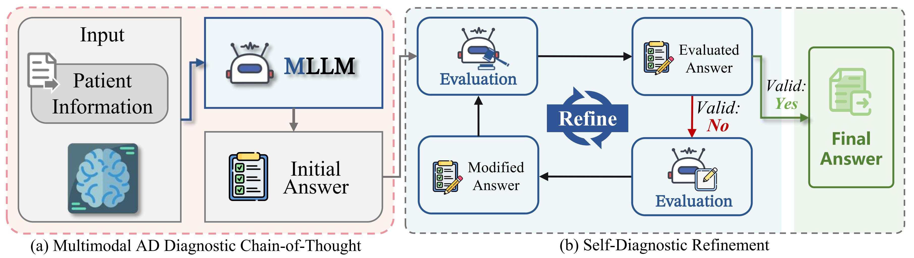

# 🧠 MDCOT: Medical Diagnosis Chain-of-Thought with Self-Diagnostic Refinement


## 📊 Framework Overview

This repository contains the open-source implementation of **MDCOT (Medical Diagnosis Chain-of-Thought with Self-Diagnostic Refinement)**, a novel framework for Alzheimer's disease diagnosis using multimodal large language models (MLLMs).

<div>

</div>

By leveraging a **Multimodal AD Diagnostic Chain-of-Thought** and a **Self-Diagnostic Refinement** module, MDCOT achieves more accurate and interpretable diagnostic reasoning.


## 🚀 Getting Started

### 🛠️ Requirements

- 🐍 Python 3.8+
- 📦 Other dependencies (see `requirements.txt`)

### 📦 Installation

```bash
git clone https://github.com/lul0308/MDCoT.git
cd MDCoT
pip install -r requirements.txt

```

### 📁 Data Preparation

📥 Download the dataset from [here](https://adni.loni.usc.edu/data-samples/adni-data/) and extract it to the `dataset` folder.


### 🧪 Evaluation

```bash
python code/main.py
```

## 📈 Model Performance
<div>

</div>

## 💬 Contact

📧 Please create Github issues here or email [Chunlin Lu](mailto:234711290@csu.edu.cn) or [Yongheng Zhang](mailto:zyhbrz@gmail.com) or [Peng Wang](mailto:wpengxss@gmail.com) or [Libo Qin](mailto:lbqin@csu.edu.cn) if you have any questions or suggestions.

